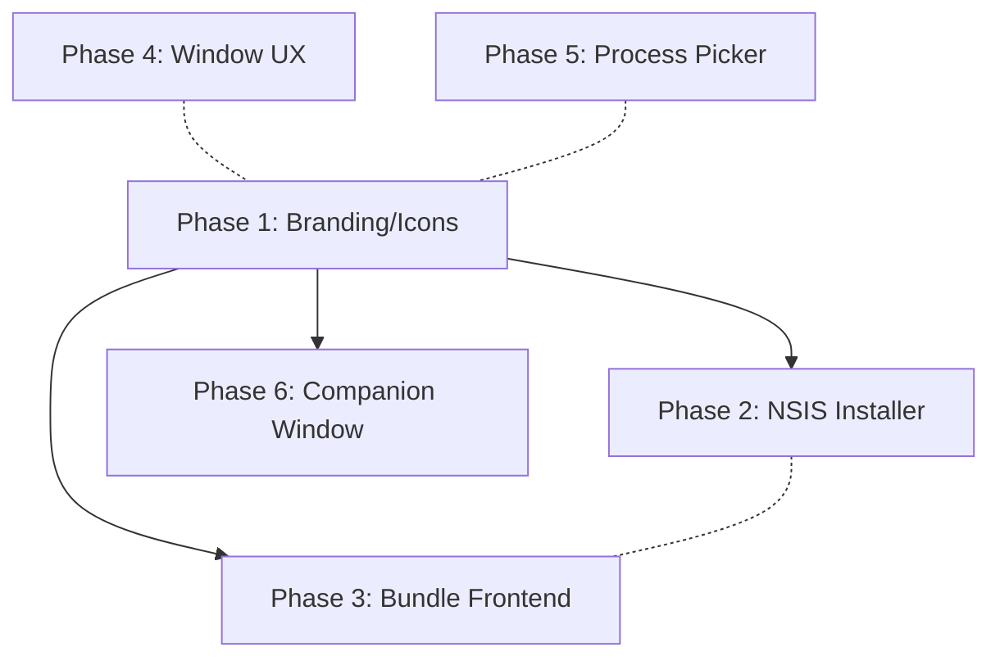

# Desktop App Fixes and Enhancements

## Testing Policy

Every phase must end with all tests passing. The rule for all agents:

> After implementing, run `pnpm lint`, `pnpm typecheck`, and the relevant test commands (`test:unit`, `test:e2e`). If a test fails, you have **3 attempts** to fix it. After 3 failed attempts, **stop and ask the user** for guidance. Do NOT keep iterating on a broken test beyond 3 tries.

Test commands (run from `apps/desktop/`):

- `pnpm run test:unit` -- unit tests
- `pnpm run test:e2e` -- e2e tests (requires build first)
- `pnpm run test:install-smoke` -- installer smoke test (Windows only)

Monorepo-wide:

- `pnpm lint` -- lint all packages
- `pnpm typecheck` -- typecheck all packages

---

## Phase 1: Branding and Icon Assets (Foundation)

**Must complete first.** All other phases depend on the icon assets existing.

### 1.1 Create Icon Generation Script

Create `apps/desktop/scripts/generate-icons.mjs` that:

- Reads `[apps/web/public/favicon.svg](apps/web/public/favicon.svg)`
- Uses `sharp` (add as devDependency) to render to PNG at 16, 32, 48, 256px
- Uses `png-to-ico` (add as devDependency) to combine PNGs into `apps/desktop/assets/icon.ico`
- Saves `apps/desktop/assets/icon.png` at 256x256
- Generates `apps/desktop/assets/installer-header.bmp` (150x57, logo centered on `#101823`)
- Generates `apps/desktop/assets/installer-sidebar.bmp` (164x314, logo near top on `#101823`)
- Add script: `"generate-icons": "node scripts/generate-icons.mjs"` in package.json

**Tests:** Run the script and assert output files exist with correct dimensions (validate with sharp). This can be a unit test in `test/unit/generate-icons.test.ts`.

### 1.2 Add productName to package.json

In `[apps/desktop/package.json](apps/desktop/package.json)`, add `"productName": "DevSuite"` at top level.

### 1.3 Add app.setAppUserModelId()

In `[apps/desktop/src/main.ts](apps/desktop/src/main.ts)`, inside `app.whenReady()` (line ~1515):

```typescript
app.setAppUserModelId('com.devsuite.desktop');
```

### 1.4 Set BrowserWindow Icon Property

In `[apps/desktop/src/main.ts](apps/desktop/src/main.ts)`:

- Main window (line 1466): add `icon: join(__dirname, '..', 'assets', 'icon.png')`
- Session widget (line 1104): add same `icon` property

### 1.5 Replace Base64 Tray Icon

In `[apps/desktop/src/main.ts](apps/desktop/src/main.ts)`:

- Replace `TRAY_ICON_DATA_URL` constant (line 139-140) and `nativeImage.createFromDataURL()` call (line 868) with `nativeImage.createFromPath(join(__dirname, '..', 'assets', 'icon.png'))`.

### 1.6 Verify

Run `pnpm lint && pnpm typecheck`. Run `pnpm --filter @devsuite/desktop test:unit`. All existing tests must still pass.

---

## Phase 2: NSIS Installer (sequential after Phase 1)

Depends on Phase 1 for icon/BMP assets.

### 2.1 Remove Electron Forge + Squirrel Dependencies

In `[apps/desktop/package.json](apps/desktop/package.json)`:

- Remove `@electron-forge/cli`, `@electron-forge/core`, `@electron-forge/maker-squirrel` from devDependencies.
- Add `electron-builder` (latest) to devDependencies.

### 2.2 Create electron-builder Config

Create `[apps/desktop/electron-builder.config.cjs](apps/desktop/electron-builder.config.cjs)`:

```js
module.exports = {
  appId: 'com.devsuite.desktop',
  productName: 'DevSuite',
  directories: { output: 'out', buildResources: 'assets' },
  files: ['dist/**/*', 'renderer/**/*', 'package.json'],
  win: {
    target: [{ target: 'nsis', arch: ['x64'] }],
    icon: 'assets/icon.ico',
  },
  nsis: {
    oneClick: false,
    allowToChangeInstallationDirectory: true,
    createDesktopIcon: true,
    createStartMenuShortcut: true,
    installerIcon: 'assets/icon.ico',
    uninstallerIcon: 'assets/icon.ico',
    installerHeader: 'assets/installer-header.bmp',
    installerSidebar: 'assets/installer-sidebar.bmp',
    shortcutName: 'DevSuite',
  },
  asar: true,
};
```

### 2.3 Remove Squirrel Lifecycle Code

In `[apps/desktop/src/main.ts](apps/desktop/src/main.ts)`:

- Delete `isSquirrelStartup` variable (line 84).
- Delete the entire `if (process.platform === 'win32') { ... squirrel ... }` block (lines 86-120).
- Remove the `if (!isSquirrelStartup)` guard around `app.whenReady()` (line 1514) -- just call `app.whenReady()` directly.

### 2.4 Update Package Scripts

In `[apps/desktop/package.json](apps/desktop/package.json)`:

- `"package"` -> `"pnpm run build && electron-builder --dir --config electron-builder.config.cjs"`
- `"make:win"` -> `"pnpm run build:all && electron-builder --win nsis --x64 --config electron-builder.config.cjs"`

### 2.5 Delete forge.config.cjs

Delete `[apps/desktop/forge.config.cjs](apps/desktop/forge.config.cjs)`.

### 2.6 Update Installer Smoke Test

In `[apps/desktop/scripts/install-smoke.ps1](apps/desktop/scripts/install-smoke.ps1)`:

- Change `$makeRoot` from `out/make` to `out` (electron-builder output).
- Change installer search pattern from `*Setup*.exe` to `*Setup*.exe` (NSIS uses same convention).
- Change `$installRoot` from `$env:LOCALAPPDATA\devsuite_desktop` to `$env:PROGRAMFILES\DevSuite`.
- Replace `$updateExe` uninstall command with `Uninstall DevSuite.exe /S`.
- Remove `Update.exe` existence checks.

### 2.7 Verify

Run `pnpm lint && pnpm typecheck`. Run `pnpm --filter @devsuite/desktop test:unit` and `pnpm --filter @devsuite/desktop test:e2e`. E2E tests must pass unchanged (they don't touch the installer).

---

## Phase 3: Bundle Frontend into Electron (sequential after Phase 1, parallel with Phase 2)

### 3.1 Create copy-renderer.mjs Script

Create `apps/desktop/scripts/copy-renderer.mjs` that:

- Copies `apps/web/dist/` to `apps/desktop/renderer/`
- Creates the directory if needed
- Fails if `apps/web/dist/` doesn't exist (with a clear error)

Add `build:all` script to `[apps/desktop/package.json](apps/desktop/package.json)`:

```
"build:all": "pnpm --filter @devsuite/web build && pnpm run build && node scripts/copy-renderer.mjs"
```

### 3.2 Register Custom Protocol Handler

In `[apps/desktop/src/main.ts](apps/desktop/src/main.ts)`, before `app.whenReady()`:

- Use `protocol.handle('devsuite', ...)` (Electron 30+) to serve files from the `renderer/` directory.
- Map `devsuite://app/` to `renderer/index.html`, and all other paths to corresponding files.
- Handle MIME types correctly (`.html`, `.js`, `.css`, `.svg`, `.png`, etc.).

### 3.3 Update resolveRendererUrl()

In `[apps/desktop/src/main.ts](apps/desktop/src/main.ts)`, refactor `resolveRendererUrl()` (line 1251):

```typescript
function resolveRendererUrl(): string | undefined {
  // 1. Explicit override always wins
  const explicitUrl = process.env.DEVSUITE_WEB_URL?.trim();
  if (explicitUrl) return explicitUrl;

  // 2. Dev mode: Vite dev server
  if (!app.isPackaged) return 'http://localhost:5173';

  // 3. Packaged: bundled renderer
  const rendererPath = join(__dirname, '..', 'renderer', 'index.html');
  if (existsSync(rendererPath)) return 'devsuite://app/';

  // 4. Fallback
  return undefined;
}
```

Add `import { existsSync } from 'node:fs';` at the top.

### 3.4 Unit Test: resolveRendererUrl Logic

Extract the URL resolution logic into a pure, testable function in a new file `apps/desktop/src/renderer-url.ts`:

- `resolveRendererUrl(options: { envUrl?: string; isPackaged: boolean; rendererExists: boolean }): string | undefined`
- Write unit tests in `apps/desktop/test/unit/renderer-url.test.ts` covering all 4 branches.

### 3.5 Verify Build

Run `pnpm --filter @devsuite/desktop build:all` and verify `apps/desktop/renderer/index.html` exists. Run unit tests, lint, typecheck.

---

## Phase 4: Main Window UX (parallel with Phases 2, 3, 5, 6)

These are small, independent changes. Can be done in a single pass.

### 4.1 Reduce minWidth

In `[apps/desktop/src/main.ts](apps/desktop/src/main.ts)` line 1469:

- Change `minWidth: 980` to `minWidth: 680`.

### 4.2 Add titleBarOverlay

In `[apps/desktop/src/main.ts](apps/desktop/src/main.ts)` line 1466, add to BrowserWindow options:

```typescript
titleBarOverlay: { color: '#0f172a', symbolColor: '#e2e8f0', height: 36 },
```

### 4.3 Suppress Browser Notification UI in Desktop

In `[apps/web/src/routes/_app.inbox.tsx](apps/web/src/routes/_app.inbox.tsx)` lines 366-404:

- Add detection: `const isDesktopRuntime = typeof window !== 'undefined' && typeof (window as any).desktopNotification !== 'undefined';`
- When `isDesktopRuntime`: replace the `<Alert>` content with "Notifications are handled by the DevSuite desktop app." and hide the enable/disable buttons.
- When not: keep existing browser notification prompt unchanged.

### 4.4 Verify

Run `pnpm lint && pnpm typecheck`. Run existing unit and e2e tests.

---

## Phase 5: Process Picker (parallel with Phases 2, 3, 4, 6)

### 5.1 Add Verbose Process Listing Functions

In `[apps/desktop/src/process-monitor.ts](apps/desktop/src/process-monitor.ts)`:

- Add `parseTasklistCsvVerbose(rawOutput: string): Array<{ executable: string; windowTitle: string }>` that parses `tasklist /fo csv /v /nh` output. The verbose CSV has columns: Image Name, PID, Session Name, Session#, Mem Usage, Status, User Name, CPU Time, Window Title.
- Add `listWindowsProcessesVerbose(): Promise<Array<{ executable: string; windowTitle: string }>>` that calls `tasklist /fo csv /v /nh` and deduplicates by executable name (keeping the entry with the longest non-empty windowTitle).

### 5.2 Unit Tests for Verbose Parsing

In `[apps/desktop/test/unit/process-monitor.test.ts](apps/desktop/test/unit/process-monitor.test.ts)`:

- Test `parseTasklistCsvVerbose()` with sample verbose CSV output.
- Test deduplication logic (multiple PIDs for same executable, picks best windowTitle).
- Test edge cases: empty windowTitle, quoted fields, no rows.

### 5.3 Add IPC Handler

In `[apps/desktop/src/main.ts](apps/desktop/src/main.ts)`, inside `registerIpcHandlers()`:

```typescript
ipcMain.handle('desktop-process-monitor:list-running', async () => {
  if (process.platform !== 'win32') return [];
  return listWindowsProcessesVerbose();
});
```

### 5.4 Expose Preload API

In `[apps/desktop/src/preload.ts](apps/desktop/src/preload.ts)`:

- Add `listRunningProcesses` to `desktopProcessMonitorApi`:

```typescript
listRunningProcesses: async () =>
  ipcRenderer.invoke('desktop-process-monitor:list-running') as Promise<
    Array<{ executable: string; windowTitle: string }>
  >,
```

- Update the `Window` type declaration.

In `[apps/web/src/vite-env.d.ts](apps/web/src/vite-env.d.ts)`:

- Add `listRunningProcesses` to the `desktopProcessMonitor` type.

### 5.5 Settings Page Process Picker UI

In `[apps/web/src/routes/_app.settings.profile.tsx](apps/web/src/routes/_app.settings.profile.tsx)`:

- Create a `ProcessPicker` component (can be inline or extracted) that:
  - Calls `window.desktopProcessMonitor?.listRunningProcesses()` on mount (with a refresh button).
  - Renders a searchable combobox (using cmdk or a simple filtered list) showing `windowTitle` as label and `executable` as value.
  - Allows adding selected processes to the IDE Watch List or App Block List.
- Falls back to existing textarea/input when `window.desktopProcessMonitor` is undefined (web-only mode).

### 5.6 Verify

Run `pnpm lint && pnpm typecheck`. Run `pnpm --filter @devsuite/desktop test:unit`.

---

## Phase 6: Companion Window Enhancements (sequential after Phase 1)

### 6.1 Taskbar Right-Click Jump List

In `[apps/desktop/src/main.ts](apps/desktop/src/main.ts)`, inside `app.whenReady()`:

```typescript
app.setUserTasks([
  {
    program: process.execPath,
    arguments: '--show-companion',
    iconPath: process.execPath,
    iconIndex: 0,
    title: 'Open companion window',
    description: 'Show the DevSuite session companion widget',
  },
]);
```

### 6.2 Single Instance Lock + --show-companion Handling

In `[apps/desktop/src/main.ts](apps/desktop/src/main.ts)`:

- Add `app.requestSingleInstanceLock()`. If lock not obtained, quit (prevents duplicate instances).
- Add `app.on('second-instance', (_, argv) => { if (argv.includes('--show-companion')) void showSessionWidget(); })`.
- In `app.whenReady()`: if `process.argv.includes('--show-companion')`, call `showSessionWidget()` after main window init.

### 6.3 Global Shortcut (Ctrl+Alt+D, overridable)

In `[apps/desktop/src/main.ts](apps/desktop/src/main.ts)`:

- Import `globalShortcut` from electron.
- Inside `app.whenReady()`: register default shortcut `Ctrl+Alt+D` -> `showSessionWidget()`.
- On `app.on('will-quit')`: `globalShortcut.unregisterAll()`.

In `[apps/desktop/src/settings-store.ts](apps/desktop/src/settings-store.ts)`:

- Add `companionShortcut` field (string, default `'Ctrl+Alt+D'`) to the persisted settings.
- Add `loadCompanionShortcut()` and `saveCompanionShortcut()` functions.

In `[apps/desktop/src/main.ts](apps/desktop/src/main.ts)`:

- Load shortcut from settings on startup; re-register when settings change via IPC.
- Add IPC handlers: `desktop-companion:get-shortcut`, `desktop-companion:set-shortcut`.

### 6.4 Auto-Show Companion on IDE Prompt

In `[apps/desktop/src/main.ts](apps/desktop/src/main.ts)`, inside `executeStrictPolicyActions()` (line ~532):

```typescript
if (action.type === 'notify' && action.kind === 'ide_session_required') {
  void showSessionWidget();
}
```

### 6.5 IPC: Show Companion from Web App

In `[apps/desktop/src/main.ts](apps/desktop/src/main.ts)`, inside `registerIpcHandlers()`:

```typescript
ipcMain.handle('desktop-session:show-companion', async () => {
  await showSessionWidget();
});
```

In `[apps/desktop/src/preload.ts](apps/desktop/src/preload.ts)`:

- Add to `desktopSessionApi`: `showCompanion: async () => { await ipcRenderer.invoke('desktop-session:show-companion'); }`
- Update the `Window` type declaration and `[apps/web/src/vite-env.d.ts](apps/web/src/vite-env.d.ts)`.

### 6.6 "Open Companion" CTA in Web Session Widget

In `[apps/web/src/components/session-widget.tsx](apps/web/src/components/session-widget.tsx)`:

- Detect: `const hasCompanion = typeof window.desktopSession?.showCompanion === 'function'`
- Add button inside the session widget popover:

```tsx
{
  hasCompanion && (
    <Button
      variant="outline"
      size="sm"
      onClick={() => window.desktopSession!.showCompanion()}
    >
      Open companion
    </Button>
  );
}
```

### 6.7 Companion Shortcut Field in Settings Page

In `[apps/web/src/routes/_app.settings.profile.tsx](apps/web/src/routes/_app.settings.profile.tsx)`:

- Add a "Companion Shortcut" input field in the Desktop Focus Settings section.
- Show current shortcut value, allow user to type a new Electron accelerator string.
- Save via the `desktop-companion:set-shortcut` IPC.

### 6.8 Unit Tests

In `apps/desktop/test/unit/settings-store.test.ts` (new file or extend existing):

- Test `loadCompanionShortcut()` returns default when no file.
- Test `saveCompanionShortcut()` persists and round-trips.
- Test invalid shortcut strings are rejected gracefully.

### 6.9 E2E Test

In `[apps/desktop/test/e2e/desktop-smoke.e2e.mjs](apps/desktop/test/e2e/desktop-smoke.e2e.mjs)`:

- Add test: `show-companion IPC handler responds` -- call `window.desktopSession.showCompanion()` and assert it resolves without error.

### 6.10 Verify

Run `pnpm lint && pnpm typecheck`. Run `pnpm --filter @devsuite/desktop test:unit` and `pnpm --filter @devsuite/desktop test:e2e`. All tests must pass.

---

## Phase Dependency Graph



- **P1** must go first (all phases need icons or touch main.ts after Squirrel removal).
- **P2** and **P3** are sequential after P1, but can run in parallel with each other.
- **P4** and **P5** are fully independent and can run in parallel with everything (after P1 just for icon paths being present, but they don't create icons themselves).
- **P6** depends on P1 for icon paths in setUserTasks.

Recommended parallelization after P1 completes:

- **Agent A:** Phase 2 (installer)
- **Agent B:** Phase 3 (bundle frontend)
- **Agent C:** Phase 4 + Phase 5 (window UX + process picker -- small enough to combine)
- **Agent D:** Phase 6 (companion window)

---

## Summary of Changed Files

**Phase 1 (Branding):**

- `apps/desktop/package.json` -- `productName`, `sharp`/`png-to-ico` devDeps, `generate-icons` script
- `apps/desktop/scripts/generate-icons.mjs` -- NEW icon generation script
- `apps/desktop/assets/icon.ico` -- NEW (generated)
- `apps/desktop/assets/icon.png` -- NEW (generated)
- `apps/desktop/assets/installer-header.bmp` -- NEW (generated)
- `apps/desktop/assets/installer-sidebar.bmp` -- NEW (generated)
- `apps/desktop/src/main.ts` -- `setAppUserModelId`, BrowserWindow icon, tray icon replacement
- `apps/desktop/test/unit/generate-icons.test.ts` -- NEW unit test

**Phase 2 (Installer):**

- `apps/desktop/package.json` -- Remove Forge deps, add electron-builder, update scripts
- `apps/desktop/forge.config.cjs` -- DELETE
- `apps/desktop/electron-builder.config.cjs` -- NEW
- `apps/desktop/src/main.ts` -- Remove Squirrel block + isSquirrelStartup guard
- `apps/desktop/scripts/install-smoke.ps1` -- Update paths for NSIS

**Phase 3 (Bundle Frontend):**

- `apps/desktop/package.json` -- `build:all` script
- `apps/desktop/scripts/copy-renderer.mjs` -- NEW
- `apps/desktop/src/main.ts` -- Protocol handler registration, resolveRendererUrl refactor
- `apps/desktop/src/renderer-url.ts` -- NEW pure function for URL resolution
- `apps/desktop/test/unit/renderer-url.test.ts` -- NEW unit tests

**Phase 4 (Window UX):**

- `apps/desktop/src/main.ts` -- `minWidth: 680`, `titleBarOverlay`
- `apps/web/src/routes/_app.inbox.tsx` -- Desktop notification suppression

**Phase 5 (Process Picker):**

- `apps/desktop/src/process-monitor.ts` -- `parseTasklistCsvVerbose()`, `listWindowsProcessesVerbose()`
- `apps/desktop/src/main.ts` -- IPC handler
- `apps/desktop/src/preload.ts` -- `listRunningProcesses` API
- `apps/desktop/test/unit/process-monitor.test.ts` -- New verbose parsing tests
- `apps/web/src/routes/_app.settings.profile.tsx` -- Process picker UI
- `apps/web/src/vite-env.d.ts` -- Type declarations

**Phase 6 (Companion):**

- `apps/desktop/src/main.ts` -- Jump list, single instance lock, global shortcut, auto-show on IDE prompt, show-companion IPC
- `apps/desktop/src/preload.ts` -- `showCompanion` API
- `apps/desktop/src/settings-store.ts` -- Companion shortcut persistence
- `apps/desktop/test/unit/settings-store.test.ts` -- NEW/extended shortcut tests
- `apps/desktop/test/e2e/desktop-smoke.e2e.mjs` -- New companion IPC test
- `apps/web/src/components/session-widget.tsx` -- "Open companion" CTA
- `apps/web/src/routes/_app.settings.profile.tsx` -- Shortcut settings field
- `apps/web/src/vite-env.d.ts` -- Type declarations
