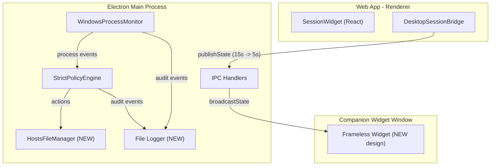
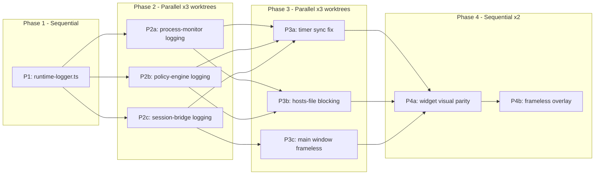

# Session Widget Companion -- Spec & Fixes

## Architecture Overview



## Phased Execution Plan



## Agent Rules

- **Worktrees:** Each parallel task creates a fresh git worktree from `main` (e.g., `git worktree add ../devsuite-p2a feat/p2a-process-logging`). After completion, open a PR back to `main`.
- **Tests required:** Every task must include unit tests (Vitest). E2e tests (Playwright/Electron) where marked. The task is not done until `pnpm test` and `pnpm typecheck` pass.
- **3-strike rule:** If a test fails and the agent cannot fix it after 3 attempts, the agent must STOP and ask the user for guidance. Do not keep churning.
- **Merge order:** Phase N+1 branches are created from `main` after all Phase N PRs are merged.

---

## Phase 1: Foundation (Sequential, 1 task)

### P1: runtime-logger.ts

**New file:** `apps/desktop/src/runtime-logger.ts`
**Test file:** `apps/desktop/src/__tests__/runtime-logger.test.ts`

Create an append-only file logger that all subsequent phases depend on.

- Writes to `app.getPath('userData')/logs/desktop-runtime.log`
- Rotate when file exceeds 2 MB (rename current to `.log.1`, start fresh)
- Format: `[ISO-timestamp] [LEVEL] [SUBSYSTEM] message`
- Levels: `debug`, `info`, `warn`, `error`
- Subsystems (string tag): `process-monitor`, `strict-policy`, `website-block`, `session-sync`, `hosts-manager`, `widget`
- Export a singleton `runtimeLog` with methods: `runtimeLog.info(subsystem, msg)`, `runtimeLog.warn(...)`, `runtimeLog.error(...)`, `runtimeLog.debug(...)`
- Must be safe to call before `app.isReady()` (queue writes until ready, or accept a log dir path)
- Graceful on write errors (never crash the app)

**Unit tests:**

- Logger writes formatted lines to a temp file
- Rotation triggers at threshold
- Graceful handling of write permission errors
- Queue behavior before initialization

**Acceptance:** `pnpm test -- runtime-logger` and `pnpm typecheck` pass.

---

## Phase 2: Diagnostic Logging (Parallel, 3 worktrees)

All three tasks depend on Phase 1 being merged. They are independent of each other.

### P2a: Process monitor logging

**Worktree branch:** `feat/p2a-process-logging`
**Files:** `[apps/desktop/src/process-monitor.ts](apps/desktop/src/process-monitor.ts)`
**Test file:** `apps/desktop/src/__tests__/process-monitor-logging.test.ts`

Changes:

- Import `runtimeLog` from `runtime-logger.ts`
- In `pollOnce()` catch block (line 416): log `runtimeLog.error('process-monitor', 'pollOnce failed: ' + fullStack)` with the error message, code, and stderr
- In `listWindowsProcesses()`: wrap execFile, on failure log command + exit code + stderr. Detect `EPERM`/`EACCES` codes and log elevated-permission hint
- In `listWindowsProcessesVerbose()`: same treatment. Log timeout specifically (8s timeout)
- In `WindowsProcessMonitor.setConfig()`: log the new config (IDE list, app list, poll interval)
- In `diffProcessEntries()`: log new started/stopped events at debug level

**Unit tests (mock execFile + runtimeLog):**

- Verify pollOnce error is logged with correct subsystem/level
- Verify EPERM detection logs permission hint
- Verify timeout error is logged distinctly
- Verify config change is logged

### P2b: Policy engine + app blocking logging

**Worktree branch:** `feat/p2b-policy-logging`
**Files:** `[apps/desktop/src/strict-policy-engine.ts](apps/desktop/src/strict-policy-engine.ts)`, `[apps/desktop/src/main.ts](apps/desktop/src/main.ts)` (lines 532-560)
**Test file:** `apps/desktop/src/__tests__/strict-policy-logging.test.ts`

Changes:

- Accept an optional `logger` parameter in `evaluateStrictPolicy()` (or use the singleton -- prefer dependency injection for testability)
- Log at each decision point:
  - `"app_block rule evaluated: executable={exe}, pid={pid}, sessionActive={bool}, overrideActive={bool}, result={action|skip}"` (debug)
  - `"app entry created: {exe}:{pid}, reason=process_started"` (info)
  - `"app entry cleared: {exe}:{pid}, reason={reason}"` (info)
  - `"website rule evaluated: domain={d}, sessionActive={bool}, result={action|skip}"` (debug)
- In `executeStrictPolicyActions()` (main.ts):
  - Before taskkill: `"Issuing taskkill: PID={pid}, exe={exe}, reason={reason}"` (warn)
  - After taskkill: `"taskkill result: PID={pid}, exitCode={code}"` (info) or `"taskkill failed: PID={pid}, error={msg}"` (error)
  - For notify actions: `"Sending notification: kind={kind}, throttleKey={key}"` (debug)

**Unit tests (inject mock logger):**

- Verify app_block rule evaluation log for a matched process
- Verify app_block skip log when session is IDLE
- Verify taskkill success/failure logging
- Verify website rule evaluation log

### P2c: Session bridge + timer sync logging

**Worktree branch:** `feat/p2c-session-logging`
**Files:** `[apps/web/src/lib/desktop-session-bridge.tsx](apps/web/src/lib/desktop-session-bridge.tsx)`, `[apps/desktop/src/main.ts](apps/desktop/src/main.ts)` (widget JS lines 1038-1098)
**Test file:** `apps/desktop/src/__tests__/session-bridge-logging.test.ts`

Changes in `desktop-session-bridge.tsx`:

- In `publishDesktopState()`: `console.debug('[desktop-bridge] publish', { status, effectiveDurationMs, connectionState, updatedAt })` (web renderer logs, visible in DevTools)
- In `onCommand` handler: `console.debug('[desktop-bridge] command received', { action, status: snapshot.activeStatus })`
- On command error: `console.warn('[desktop-bridge] command failed', { action, error })`

Changes in widget JS (main.ts `createSessionWidgetHtml`):

- In `renderState()`: `console.debug('[widget] state received', { status, effectiveDurationMs, updatedAt, computedDuration })`
- In stale detection (line 1090-1097): `console.warn('[widget] bridge signal stale', { staleForMs, lastSignalAt })`
- These console logs are visible via Electron DevTools on the widget window

Note: The widget JS runs in a sandboxed renderer with no Node access, so it uses `console.*` rather than `runtimeLog`. For main-process side logging of IPC state changes, add `runtimeLog.debug('session-sync', ...)` in `broadcastDesktopSessionState()` (main.ts line 335).

**Unit tests:**

- Test that `broadcastDesktopSessionState` calls runtimeLog with state snapshot
- Test the `console.debug` calls are present (via spy in JSDOM for the bridge component)

---

## Phase 3: Core Bug Fixes + Main Window (Parallel, 3 worktrees)

All three tasks depend on all Phase 2 PRs being merged. They are independent of each other.

### P3a: Timer sync fix

**Worktree branch:** `feat/p3a-timer-sync`
**Files:** `[apps/web/src/lib/desktop-session-bridge.tsx](apps/web/src/lib/desktop-session-bridge.tsx)`, `[apps/desktop/src/main.ts](apps/desktop/src/main.ts)` (widget JS)
**Test files:** `apps/desktop/src/__tests__/widget-timer-calc.test.ts`, `apps/web/src/__tests__/desktop-session-bridge.test.ts`

**Root cause recap:**

- 15s publish interval creates base-value staleness
- When base updates, `Date.now() - updatedAt` resets, causing visible timer jumps

**Changes in `desktop-session-bridge.tsx`:**

1. Reduce interval from `15000` to `5000` (line 277)
2. Add `publishedAt: Date.now()` alongside existing `updatedAt` in the payload (line 251)
3. Ensure `effectiveDurationMs` changes trigger immediate re-publish (verify dependency array)

**Changes in widget JS (`calculateEffectiveDuration`):**

1. Use `state.publishedAt` (fallback to `state.updatedAt`) for the live increment
2. Add jump smoothing: track `previousDisplayedMs`. If new computed value differs from previous by >2000ms, lerp over 1 second (60 frames) instead of jumping

**Widget JS pseudocode for smoothing:**

```javascript
let displayedMs = 0;
let targetMs = 0;
let smoothingUntil = 0;

function updateTimer() {
  const raw = calculateEffectiveDuration(currentState);
  const jump = Math.abs(raw - displayedMs);
  if (jump > 2000 && Date.now() < smoothingUntil + 2000) {
    // already smoothing, just update target
    targetMs = raw;
  } else if (jump > 2000) {
    targetMs = raw;
    smoothingUntil = Date.now() + 1000;
  } else {
    displayedMs = raw;
    targetMs = raw;
  }
  if (Date.now() < smoothingUntil) {
    displayedMs += (targetMs - displayedMs) * 0.15;
  } else {
    displayedMs = targetMs;
  }
  timerElement.textContent = formatDuration(displayedMs);
}
```

**Unit tests:**

- `calculateEffectiveDuration` returns `base + (now - publishedAt)` when RUNNING
- `calculateEffectiveDuration` returns `base` when PAUSED
- Smoothing logic does not jump more than 2s in a single tick
- Bridge publishes at 5s interval (mock setInterval)

**E2e test** (if Electron test harness exists):

- Start session via web, verify widget timer is within 2s of web timer after 30s

### P3b: Hosts-file website blocking

**Worktree branch:** `feat/p3b-hosts-blocking`
**New file:** `apps/desktop/src/hosts-manager.ts`
**Test files:** `apps/desktop/src/__tests__/hosts-manager.test.ts`, `apps/desktop/src/__tests__/hosts-manager-integration.test.ts`

**Implementation (`hosts-manager.ts`):**

- `HOSTS_PATH = 'C:\\Windows\\System32\\drivers\\etc\\hosts'` (configurable for tests)
- `BEGIN_MARKER = '# BEGIN DEVSUITE BLOCK'`, `END_MARKER = '# END DEVSUITE BLOCK'`
- `blockDomains(domains: string[], options?: { hostsPath?: string })`:
  1. Read current hosts file
  2. Remove any existing DEVSUITE BLOCK section
  3. Build new block: for each domain, add `127.0.0.1 {domain}` and `127.0.0.1 www.{domain}`
  4. Append block between markers
  5. Write file back (elevated: use `@vscode/sudo-prompt` or `child_process` with `powershell Start-Process`)
  6. Run `ipconfig /flushdns`
  7. Log all operations via `runtimeLog`
- `unblockAll(options?: { hostsPath?: string })`:
  1. Read hosts file
  2. Remove DEVSUITE BLOCK section
  3. Write back
  4. Run `ipconfig /flushdns`
  5. Log
- `cleanupStaleBlocks(options?: { hostsPath?: string })`: same as unblockAll, called on app startup
- `reconcileDomains(currentDomains: string[], newDomains: string[])`: diff and call blockDomains with new set

**Elevated permissions strategy:**

- Use `child_process.execFile('powershell', ['-Command', 'Start-Process cmd -ArgumentList ... -Verb RunAs'])` or investigate `@nicedoc/sudo-prompt`
- If elevation is denied, log the error and fall back to notification-only mode (existing behavior)
- Log the permission prompt and its result

**Integration in main.ts:**

- In session state change handler (where `desktopSessionState` is updated):
  - `IDLE -> RUNNING`: call `blockDomains(desktopFocusSettings.websiteBlockList)`
  - `RUNNING/PAUSED -> IDLE`: call `unblockAll()`
- In settings change handler: if session is active, call `reconcileDomains(old, new)`
- `app.on('before-quit')`: call `unblockAll()` as safety net
- `app.on('ready')`: call `cleanupStaleBlocks()` for crash recovery

**Unit tests (use temp file as hostsPath):**

- `blockDomains` adds correct entries between markers
- `blockDomains` with existing block replaces it
- `unblockAll` removes only the DEVSUITE section, preserves other entries
- `cleanupStaleBlocks` removes markers from a file with stale entries
- Domain normalization (www prefix, lowercase)
- Empty domain list is a no-op

**E2e test:**

- Mock elevated write (use temp dir), verify hosts file contents after block/unblock cycle
- Verify DNS flush command is called

### P3c: Main window frameless + custom titlebar

**Worktree branch:** `feat/p3c-frameless-main`
**Files:**

- `[apps/desktop/src/main.ts](apps/desktop/src/main.ts)` (lines 1637-1666, `createMainWindow`)
- `[apps/desktop/src/preload.ts](apps/desktop/src/preload.ts)` (new IPC channels)
- `[apps/web/src/components/header.tsx](apps/web/src/components/header.tsx)` (add window controls)
- `apps/web/src/components/window-controls.tsx` -- NEW
  **Test files:** `apps/web/src/__tests__/window-controls.test.tsx`, `apps/desktop/src/__tests__/window-controls-ipc.test.ts`

**Problem:** The main window uses `titleBarOverlay` with dark colors (`#0f172a`), but Windows system light theme overrides these, producing a white titlebar that clashes with the dark app. The `titleBarOverlay` API is unreliable across Windows versions and theme modes.

**Solution:** Make the main window fully frameless and add custom window controls to the web app header.

**Step 1 -- BrowserWindow config changes in `createMainWindow()`:**

```typescript
const mainWindow = new BrowserWindow({
  width: 1320,
  height: 860,
  minWidth: 680,
  minHeight: 640,
  frame: false, // CHANGED: remove native frame entirely
  autoHideMenuBar: true,
  backgroundColor: '#0f172a', // CHANGED: match app dark bg (was #f8fafc light)
  show,
  icon: APP_ICON_PATH,
  // REMOVED: titleBarOverlay (no longer needed)
  webPreferences: {
    /* unchanged */
  },
});
```

**Step 2 -- Add IPC channels in `preload.ts`:**

Expose `window.desktopWindow` API:

```typescript
desktopWindow: {
  minimize: () => ipcRenderer.invoke('desktop-window:minimize'),
  maximize: () => ipcRenderer.invoke('desktop-window:maximize'),
  close: () => ipcRenderer.invoke('desktop-window:close'),
  isMaximized: () => ipcRenderer.invoke('desktop-window:is-maximized'),
  onMaximizeChange: (cb: (maximized: boolean) => void) => { /* IPC listener */ },
}
```

Add corresponding `ipcMain.handle` handlers in `main.ts`:

```typescript
ipcMain.handle('desktop-window:minimize', event => {
  BrowserWindow.fromWebContents(event.sender)?.minimize();
});
ipcMain.handle('desktop-window:maximize', event => {
  const win = BrowserWindow.fromWebContents(event.sender);
  if (win?.isMaximized()) {
    win.unmaximize();
  } else {
    win?.maximize();
  }
});
ipcMain.handle('desktop-window:close', event => {
  BrowserWindow.fromWebContents(event.sender)?.close();
});
ipcMain.handle('desktop-window:is-maximized', event => {
  return BrowserWindow.fromWebContents(event.sender)?.isMaximized() ?? false;
});
```

Broadcast maximize/unmaximize changes:

```typescript
mainWindow.on('maximize', () =>
  mainWindow.webContents.send('desktop-window:maximize-changed', true)
);
mainWindow.on('unmaximize', () =>
  mainWindow.webContents.send('desktop-window:maximize-changed', false)
);
```

**Step 3 -- New component `apps/web/src/components/window-controls.tsx`:**

Custom titlebar controls that only render when `window.desktopWindow` is available:

```
[—] [□] [X]
```

- Three buttons: minimize, maximize/restore, close
- Positioned absolute top-right of header
- Match app theme: `text-muted-foreground`, hover `text-foreground`, close hover `bg-destructive text-destructive-foreground`
- Use lucide icons: `Minus`, `Square`/`Maximize2`, `X`
- Listen to `onMaximizeChange` to toggle the maximize/restore icon
- All buttons: `-webkit-app-region: no-drag`

**Step 4 -- Update `header.tsx`:**

- Add `-webkit-app-region: drag` to the header `<header>` element (makes entire header draggable)
- Add `-webkit-app-region: no-drag` to all interactive elements inside (buttons, dropdowns, links, company switcher)
- Conditionally render `<WindowControls />` when `window.desktopWindow` exists
- Add right padding (~120px) when in desktop mode to avoid content overlapping window controls

**Step 5 -- TypeScript declarations:**

Add `window.desktopWindow` to the global type declarations (wherever other desktop APIs like `window.desktopSession` are declared).

**Unit tests:**

- `WindowControls` renders minimize/maximize/close buttons
- `WindowControls` does not render when `window.desktopWindow` is undefined (web-only mode)
- Clicking minimize calls `window.desktopWindow.minimize()`
- Maximize icon toggles between maximize/restore based on state
- IPC handlers call correct BrowserWindow methods (mock BrowserWindow)

**E2e test:**

- Main window has `frame: false`
- Header is draggable (has `-webkit-app-region: drag`)
- Clicking minimize button minimizes window
- Clicking maximize button toggles maximize state
- Clicking close button closes window

---

## Phase 4: Widget Redesign (Sequential, 2 tasks on same branch or chained)

Depends on all Phase 3 PRs being merged. P4b depends on P4a.

### P4a: Widget visual parity

**Worktree branch:** `feat/p4a-widget-visual`
**Files:** `[apps/desktop/src/main.ts](apps/desktop/src/main.ts)` (lines 906-1103, `createSessionWidgetHtml()`)
**Test file:** `apps/desktop/src/__tests__/widget-html.test.ts`

Rewrite `createSessionWidgetHtml()` to match `[session-widget.tsx](apps/web/src/components/session-widget.tsx)` styles:

**CSS tokens (match web app `styles.css`):**

- `--bg: #0f172a` (slate-950)
- `--card: #111827` (gray-900)
- `--primary: #22d3ee` (cyan-400, from `hsl(189, 88%, 53%)`)
- `--primary-foreground: #0a0a0a`
- `--foreground: #fafafa`
- `--muted-foreground: #64748b`
- `--border: #1e293b` (slate-800)
- `--destructive: #7f1d1d`

**Layout:**

```
+------------------------------------------+
|  Status: RUNNING          [RUNNING badge] |
|                                           |
|  00:45:23            (large mono timer)   |
|  connected                                |
|                                           |
|  [Pause]         [End Session]            |
+------------------------------------------+
```

- Status line: flex row, `text-sm`, badge on right
- Badge: pill shape, RUNNING=cyan bg, PAUSED=gray bg, IDLE=border-only
- Timer: `font-family: ui-monospace, monospace; font-size: 24px; font-weight: 600;`
- Meta: `font-size: 11px; color: var(--muted-foreground);`
- Buttons: 2-column grid, contextual visibility:
  - IDLE: `[Start]` full-width spanning both columns
  - RUNNING: `[Pause] [End Session]`
  - PAUSED: `[Resume] [End Session]`
- Button styles: primary=`bg: var(--primary), color: var(--primary-foreground)`, secondary=`bg: #1e293b, color: var(--foreground)`, destructive-outline=`border: 1px solid var(--destructive), color: #fca5a5`
- Error line: `font-size: 11px; color: #fca5a5; min-height: 14px;`

**JS changes:**

- `setButtonStates` becomes `renderButtons` -- show/hide buttons based on status, not just disable
- Add `renderBadge(status)` function

**Unit tests:**

- `createSessionWidgetHtml()` returns valid HTML (parse with JSDOM)
- Contains expected CSS custom properties
- Button visibility for each status (IDLE/RUNNING/PAUSED) via JSDOM + `renderButtons`
- Badge renders correct class per status

### P4b: Frameless overlay

**Worktree branch:** `feat/p4b-frameless-overlay`
**Files:** `[apps/desktop/src/main.ts](apps/desktop/src/main.ts)` (lines 1112-1146, `showSessionWidget()` + `createSessionWidgetHtml()`)
**Test file:** `apps/desktop/src/__tests__/widget-window.test.ts`

**BrowserWindow config:**

```typescript
new BrowserWindow({
  width: 290,
  height: 180,
  frame: false,
  transparent: true,
  resizable: false,
  minimizable: false,
  maximizable: false,
  alwaysOnTop: true,
  skipTaskbar: true,
  hasShadow: false,
  backgroundColor: '#00000000',
  icon: APP_ICON_PATH,
  webPreferences: {
    /* unchanged */
  },
});
```

**Positioning logic (new function `positionWidgetBottomRight`):**

```typescript
function positionWidgetBottomRight(win: BrowserWindowType): void {
  const { width, height } = screen.getPrimaryDisplay().workAreaSize;
  const [winWidth, winHeight] = win.getSize();
  win.setPosition(width - winWidth - 16, height - winHeight - 16);
}
```

- Call on widget creation
- Listen to `screen.on('display-metrics-changed')` to reposition

**CSS additions in widget HTML:**

- `html, body { background: transparent; overflow: hidden; margin: 0; padding: 0; }`
- `.card { -webkit-app-region: drag; opacity: 0.92; border-radius: 12px; position: relative; padding: 14px; }`
- `.card * { -webkit-app-region: no-drag; }` then re-enable drag on the card itself
- Actually: all interactive elements (`button`, `a`) get `-webkit-app-region: no-drag;`
- Close button:
  ```css
  .close-btn {
    position: absolute;
    top: 6px;
    right: 6px;
    width: 20px;
    height: 20px;
    border: none;
    background: transparent;
    color: var(--muted-foreground);
    font-size: 14px;
    opacity: 0;
    transition: opacity 0.2s;
    cursor: pointer;
    -webkit-app-region: no-drag;
    display: flex;
    align-items: center;
    justify-content: center;
    border-radius: 4px;
  }
  .close-btn:hover {
    background: rgba(255, 255, 255, 0.1);
    color: var(--foreground);
  }
  .card:hover .close-btn {
    opacity: 1;
  }
  ```
- Close button HTML: `<button class="close-btn" id="closeBtn" title="Close">&times;</button>`
- JS: `closeBtn.addEventListener('click', () => window.close())`

**E2e tests (Electron test harness):**

- Widget window is created with `frame: false`
- Widget window `alwaysOnTop` is true
- Widget position is bottom-right within 20px of expected
- Close button hidden by default, visible on card hover (if Playwright-Electron supports hover)

---

## Files Changed Summary

**Phase 1:**

- `apps/desktop/src/runtime-logger.ts` -- NEW
- `apps/desktop/src/__tests__/runtime-logger.test.ts` -- NEW

**Phase 2a:**

- `apps/desktop/src/process-monitor.ts` -- add logging
- `apps/desktop/src/__tests__/process-monitor-logging.test.ts` -- NEW

**Phase 2b:**

- `apps/desktop/src/strict-policy-engine.ts` -- add logging (DI logger)
- `apps/desktop/src/main.ts` -- add logging in `executeStrictPolicyActions`
- `apps/desktop/src/__tests__/strict-policy-logging.test.ts` -- NEW

**Phase 2c:**

- `apps/web/src/lib/desktop-session-bridge.tsx` -- add console.debug logging
- `apps/desktop/src/main.ts` -- add runtimeLog in `broadcastDesktopSessionState`
- `apps/desktop/src/__tests__/session-bridge-logging.test.ts` -- NEW

**Phase 3a:**

- `apps/web/src/lib/desktop-session-bridge.tsx` -- 5s interval, publishedAt field
- `apps/desktop/src/main.ts` -- widget JS timer smoothing
- `apps/desktop/src/__tests__/widget-timer-calc.test.ts` -- NEW
- `apps/web/src/__tests__/desktop-session-bridge.test.ts` -- NEW

**Phase 3b:**

- `apps/desktop/src/hosts-manager.ts` -- NEW
- `apps/desktop/src/main.ts` -- integration with session lifecycle
- `apps/desktop/src/__tests__/hosts-manager.test.ts` -- NEW
- `apps/desktop/src/__tests__/hosts-manager-integration.test.ts` -- NEW

**Phase 3c:**

- `apps/desktop/src/main.ts` -- `frame: false`, remove `titleBarOverlay`, dark `backgroundColor`, IPC handlers for minimize/maximize/close, broadcast maximize state
- `apps/desktop/src/preload.ts` -- expose `window.desktopWindow` API
- `apps/web/src/components/window-controls.tsx` -- NEW custom titlebar buttons
- `apps/web/src/components/header.tsx` -- add drag region, conditionally render WindowControls, desktop padding
- `apps/web/src/__tests__/window-controls.test.tsx` -- NEW
- `apps/desktop/src/__tests__/window-controls-ipc.test.ts` -- NEW

**Phase 4a:**

- `apps/desktop/src/main.ts` -- rewrite `createSessionWidgetHtml()`
- `apps/desktop/src/__tests__/widget-html.test.ts` -- NEW

**Phase 4b:**

- `apps/desktop/src/main.ts` -- frameless BrowserWindow, positioning, close button
- `apps/desktop/src/__tests__/widget-window.test.ts` -- NEW

## Open Questions Resolved

- **Always-on-top?** Yes, keep `alwaysOnTop: true` (already set)
- **Ignore mouse when transparent?** No -- card body is draggable, buttons are clickable. The 0.92 opacity is just visual
- **Quick actions?** Pause and End when RUNNING; Resume and End when PAUSED; Start when IDLE (contextual)
- **Electron or native for header?** Electron `frame: false` with custom CSS drag region
- **Main window header?** Also frameless. Windows system theme overrides `titleBarOverlay` colors, so we go fully custom with `-webkit-app-region: drag` on header and custom minimize/maximize/close buttons
