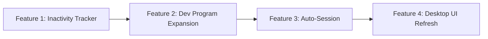

# Implementation Plan: Activity Tracking & Auto-Sessions

## Summary

Four features for DevSuite's desktop app:

1. **Inactivity-based session pausing** — auto-pause after 5 min; auto-resume with toast
2. **Expanded dev program detection** — two-tier classification + browser extension for website tracking
3. **Automatic session creation** — start sessions automatically; land in default project
4. **Desktop page UI refresh** — reduce clutter, improve information hierarchy

---

## Development Approach: TDD-First

All features follow test-driven development using existing conventions:

### Unit Tests

- **Runner:** `tsx --test` via `pnpm test:unit` in `apps/desktop`
- **Framework:** Node.js built-in `node:test` + `node:assert/strict`
- **Pattern:** Pure function tests with factory helpers (e.g., `createSettings()`, `createInput()`)
- **Location:** `apps/desktop/test/unit/<module>.test.ts`

### E2E Tests

- **Runner:** WebdriverIO + Mocha via `pnpm test:e2e`
- **Framework:** `wdio-electron-service` + `expect-webdriverio`
- **Pattern:** Desktop bridge injection (`globalThis.window.desktopTest.*`)
- **Location:** `apps/desktop/test/e2e/desktop-smoke.e2e.mjs`

### TDD Workflow Per Feature

```
1. Write failing unit tests for new module
2. Implement module until tests pass
3. Add e2e tests for IPC integration
4. Wire module into main.ts
5. Run full suite: pnpm test:unit && pnpm test:e2e
```

---

## Notification Collision Prevention

> [!IMPORTANT]
> New notification kinds MUST be registered in the `DesktopNotificationKind` union type in `notifications.ts` and use **unique throttle key namespaces** to avoid collisions with existing notifications.

### Existing notification kinds (DO NOT reuse)

`session_started`, `session_paused`, `session_resumed`, `session_ended`, `ide_session_required`, `distractor_app_detected`, `website_blocked_detected`, `tasks_remaining_reminder`, `inbox_item`

### New notification kinds to register

| Kind                   | Throttle Key Namespace                      | Purpose                                        |
| ---------------------- | ------------------------------------------- | ---------------------------------------------- |
| `inactivity_paused`    | `{userId}:{companyId}:inactivity:paused`    | Session auto-paused due to inactivity          |
| `inactivity_resumed`   | `{userId}:{companyId}:inactivity:resumed`   | Session auto-resumed when dev activity returns |
| `auto_session_started` | `{userId}:{companyId}:auto_session:started` | Automatic session was created                  |
| `auto_session_review`  | `{userId}:{companyId}:auto_session:review`  | Post-session review prompt                     |

**Throttle strategy:** Each new kind gets its own namespace prefix, ensuring zero overlap with existing strict-policy notifications. Throttle windows: `inactivity_paused/resumed` = 60s, `auto_session_started` = 120s, `auto_session_review` = 0ms (always show).

---

## Native Dialogs

All user prompts use **Electron's native `dialog.showMessageBox()`** instead of custom HTML overlays:

| Prompt                            | Dialog Type                                     | Buttons                                  |
| --------------------------------- | ----------------------------------------------- | ---------------------------------------- |
| Post-session review               | `dialog.showMessageBox` with `type: 'question'` | [Assign Project] [Add Summary] [Discard] |
| Auto-session started notification | Native toast (`Notification` API)               | Click → opens app                        |
| Inactivity pause/resume           | Native toast                                    | Informational only                       |

---

## Feature 1: Inactivity-Based Session Pausing

### Rationale

The current `ForegroundWindowTracker` only watches a single `recordingIDE`. Inactivity detection needs to watch the full `devCoreList` and fire when NO dev program has been in focus for ≥ 5 minutes.

### TDD Plan

#### Tests first: `test/unit/inactivity-tracker.test.ts`

```
✦ fires onInactive after threshold with no activity
✦ recordActivity() resets the inactivity clock
✦ fires onActive when activity resumes after inactivity
✦ does not fire onInactive if activity within threshold
✦ stop() cancels pending timers
✦ respects configurable threshold
✦ does not fire duplicate onInactive without intervening onActive
```

#### Implementation

##### [NEW] [inactivity-tracker.ts](file:///home/sebherrerabe/repos/devsuite/apps/desktop/src/inactivity-tracker.ts)

- `InactivityTracker` class
- `recordActivity(executable: string)` — resets `lastActiveAt`
- Polls every 30s; fires `onInactive()` when `now - lastActiveAt >= threshold`
- Fires `onActive()` on next `recordActivity()` after inactivity

##### [MODIFY] [foreground-window-tracker.ts](file:///home/sebherrerabe/repos/devsuite/apps/desktop/src/foreground-window-tracker.ts)

- Accept `watchList: string[]` instead of single `recordingIDE`
- Emit `onAnyDevFocusChange(executable, focused)` callback for inactivity tracker consumption
- Keep existing single-IDE tracking for `effectiveDurationMs` backward compat

##### [MODIFY] [focus-settings.ts](file:///home/sebherrerabe/repos/devsuite/apps/desktop/src/focus-settings.ts)

- Add `inactivityThresholdSeconds: number` (default: 300, min: 60, max: 3600)
- Add `autoInactivityPause: boolean` (default: `true`)

##### [MODIFY] [notifications.ts](file:///home/sebherrerabe/repos/devsuite/apps/desktop/src/notifications.ts)

- Register `inactivity_paused` and `inactivity_resumed` in `DesktopNotificationKind`

##### [MODIFY] [main.ts](file:///home/sebherrerabe/repos/devsuite/apps/desktop/src/main.ts)

- Wire `InactivityTracker` → session pause/resume + native toast

##### [MODIFY] [schema.ts](file:///home/sebherrerabe/repos/devsuite/convex/schema.ts) + [userSettings.ts](file:///home/sebherrerabe/repos/devsuite/convex/userSettings.ts)

- Add `inactivityThresholdSeconds` and `autoInactivityPause` to `desktopFocus`

---

## Feature 2: Expanded Dev Program Detection

### Rationale

Dev work spans more than IDEs. Two-tier classification prevents false positives: `devCoreList` drives the inactivity clock; `devSupportList` is informational.

### How We Track Activity on Windows

**Native apps (terminals, Figma, DB tools):**

- Already handled by `WindowsProcessMonitor` (polls `tasklist` every 4s)
- We add `'dev_support'` as a third `DesktopProcessCategory` alongside `'ide'` and `'app_block'`

**Browser tabs (ChatGPT, Claude, localhost):**

- `active-win` / `get-windows` cannot return browser URLs on Windows — only the window title
- We extend the existing browser extension with a **dev site allowlist**
- Extension uses `chrome.tabs.onActivated` + `chrome.tabs.onUpdated` → POSTs `{ type: 'dev_site_active', domain }` to the desktop's local IPC
- **Browser support:** Chromium-based (Chrome, Edge, Brave, Opera) + Firefox. No Safari (high complexity, low dev share). Firefox uses compatible WebExtensions API with a `browser` vs `chrome` namespace shim.

### TDD Plan

#### Extend: `test/unit/process-monitor.test.ts`

```
✦ dev_support category correctly identified from devSupportExecutables
✦ devSupportExecutables wired into buildMonitoredEntries
✦ dev_support events do NOT trigger strict policy enforcement
```

#### Extend: `test/unit/focus-settings.test.ts`

```
✦ devSupportList parses and normalizes correctly
✦ devSiteList parses and normalizes domains
✦ backward compat: ideWatchList alias still works when devCoreList is absent
```

#### Implementation

##### [MODIFY] [focus-settings.ts](file:///home/sebherrerabe/repos/devsuite/apps/desktop/src/focus-settings.ts)

- Rename `ideWatchList` → `devCoreList` (backward-compat alias)
- Add `devSupportList: string[]` (default: `['wt.exe', 'windowsterminal.exe', 'powershell.exe', 'cmd.exe']`)
- Add `devSiteList: string[]` (default: `['chat.openai.com', 'claude.ai', 'github.com', 'localhost']`)

##### [MODIFY] [process-monitor.ts](file:///home/sebherrerabe/repos/devsuite/apps/desktop/src/process-monitor.ts)

- Add `'dev_support'` to `DesktopProcessCategory`
- Add `devSupportExecutables` to `DesktopProcessWatchConfig`

##### Browser Extension (extend existing)

- Add `devSiteList` listener using `chrome.tabs.onActivated/onUpdated`
- POST matched domains to local IPC endpoint
- Firefox compat via `typeof browser !== 'undefined' ? browser : chrome`

---

## Feature 3: Automatic Session Creation

### Rationale

Manual "start session" breaks immersion. When coding is detected with no session, DevSuite starts one under the company's default project (`isDefault: true` already in schema).

### TDD Plan

#### Tests first: `test/unit/auto-session-manager.test.ts`

```
✦ starts warm-up timer on devCoreList process_started with no active session
✦ does NOT start warm-up if session already RUNNING or PAUSED
✦ creates session after warm-up completes
✦ cancels warm-up if process_stopped before warm-up completes
✦ does not create duplicate sessions on multiple process_started events
✦ triggers post-session review on session end
✦ respects autoSession=false toggle (no-op when disabled)
```

#### E2E test additions in `desktop-smoke.e2e.mjs`

```
✦ auto-session created when devCoreList process detected and warm-up elapses
✦ post-session native dialog appears after auto-session ends
✦ auto-session notification does not collide with existing ide_session_required
```

#### Implementation

##### [NEW] [auto-session-manager.ts](file:///home/sebherrerabe/repos/devsuite/apps/desktop/src/auto-session-manager.ts)

- `AutoSessionManager` class
- Listens to `process_started/stopped` events for `devCoreList`
- Warm-up timer (default 120s); creates session via Convex mutation after timer
- On session end: calls `dialog.showMessageBox()` for post-session review
- Pure logic core (testable), thin Electron shell

##### [MODIFY] [focus-settings.ts](file:///home/sebherrerabe/repos/devsuite/apps/desktop/src/focus-settings.ts)

- Add `autoSession: boolean` (default: `false`)
- Add `autoSessionWarmupSeconds: number` (default: 120, min: 30, max: 600)

##### [MODIFY] [notifications.ts](file:///home/sebherrerabe/repos/devsuite/apps/desktop/src/notifications.ts)

- Register `auto_session_started` and `auto_session_review` kinds
- Unique throttle key namespace: `auto_session:*`

##### [MODIFY] [schema.ts](file:///home/sebherrerabe/repos/devsuite/convex/schema.ts)

- Add `isAutoCreated: v.optional(v.boolean())` to `sessions` table
- Extend `desktopFocus` with `autoSession`, `autoSessionWarmupSeconds`

##### [MODIFY] [sessions.ts](file:///home/sebherrerabe/repos/devsuite/convex/sessions.ts)

- Accept `isAutoCreated` in start mutation
- Auto-assign default project if no `projectIds` provided

##### [MODIFY] [main.ts](file:///home/sebherrerabe/repos/devsuite/apps/desktop/src/main.ts)

- Wire `AutoSessionManager` + native dialogs

---

## Feature 4 (Bonus): Desktop Page UI Refresh

### Rationale

Adding inactivity threshold, devSupportList, devSiteList, and autoSession settings makes the current flat settings page too crowded. Group into logical sections.

### Proposed Layout

Three card sections:

1. **Activity Detection** — devCoreList, devSupportList, devSiteList, inactivity threshold, auto-pause
2. **Auto-Session** — enable toggle, warmup duration
3. **Focus & Enforcement** — strictMode, appBlockList, websiteBlockList, reminder interval, grace period

Pure frontend change in `apps/web`. Uses existing shadcn/ui components (Card, Switch, Slider).

---

## Execution Order



Each feature is independently testable and deployable. Feature 2 builds on Feature 1's tracker. Feature 3 consumes both.

---

## Verification Summary

| Suite       | Command                             | What it covers                                       |
| ----------- | ----------------------------------- | ---------------------------------------------------- |
| Unit tests  | `cd apps/desktop && pnpm test:unit` | All pure logic modules                               |
| E2E tests   | `cd apps/desktop && pnpm test:e2e`  | IPC wiring, bridge injection, native dialog triggers |
| Integration | `cd apps/desktop && pnpm test:int`  | Settings store persistence                           |
| Full check  | `pnpm test:unit && pnpm test:e2e`   | Gate before merge                                    |
